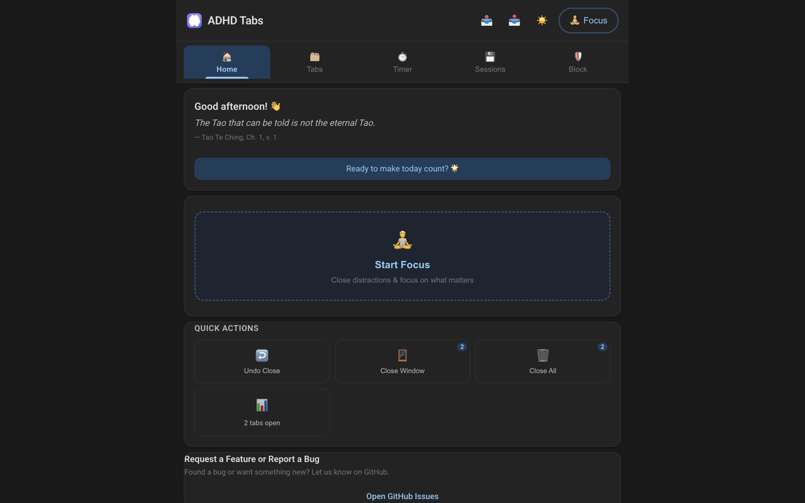
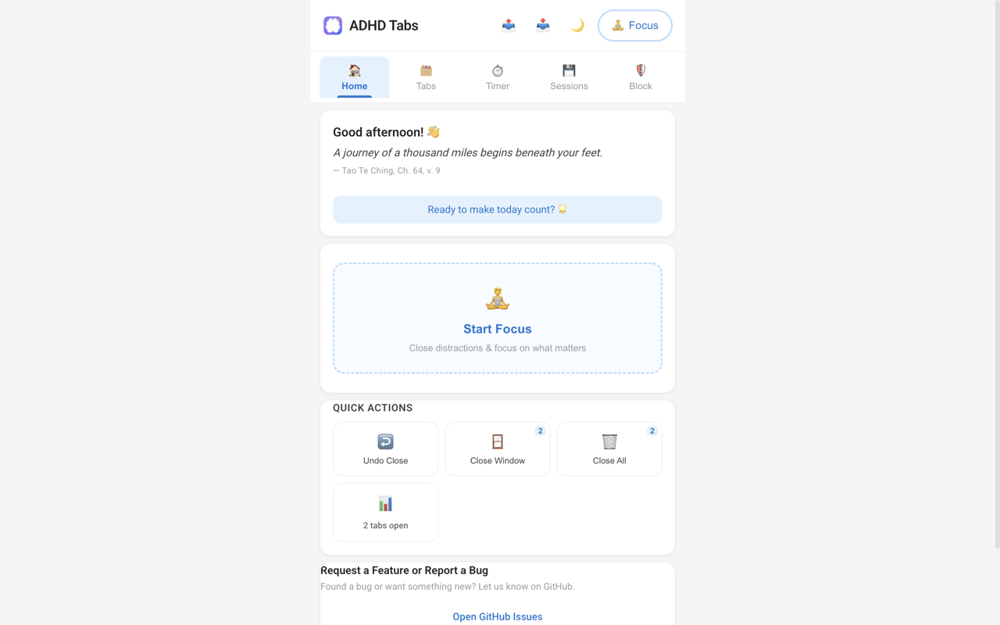
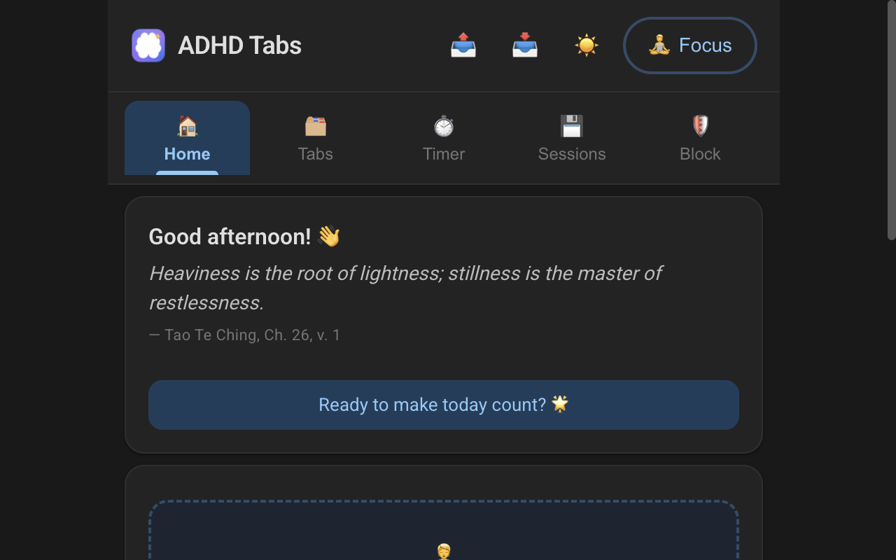
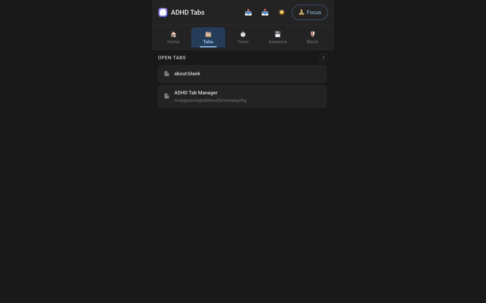
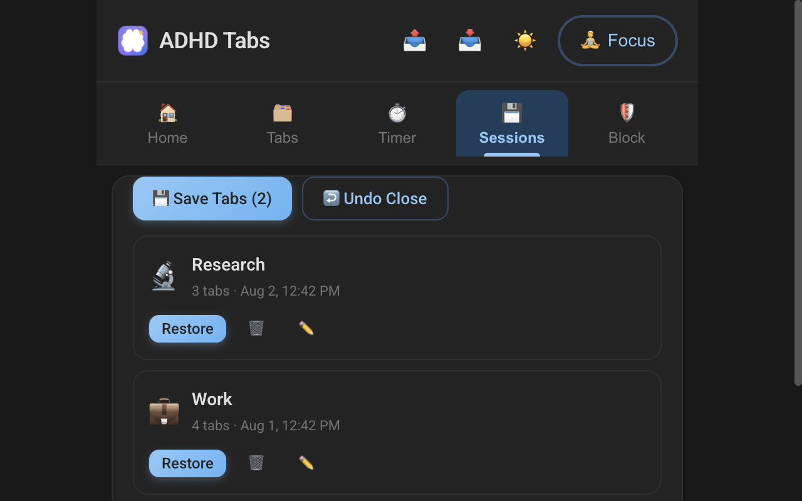
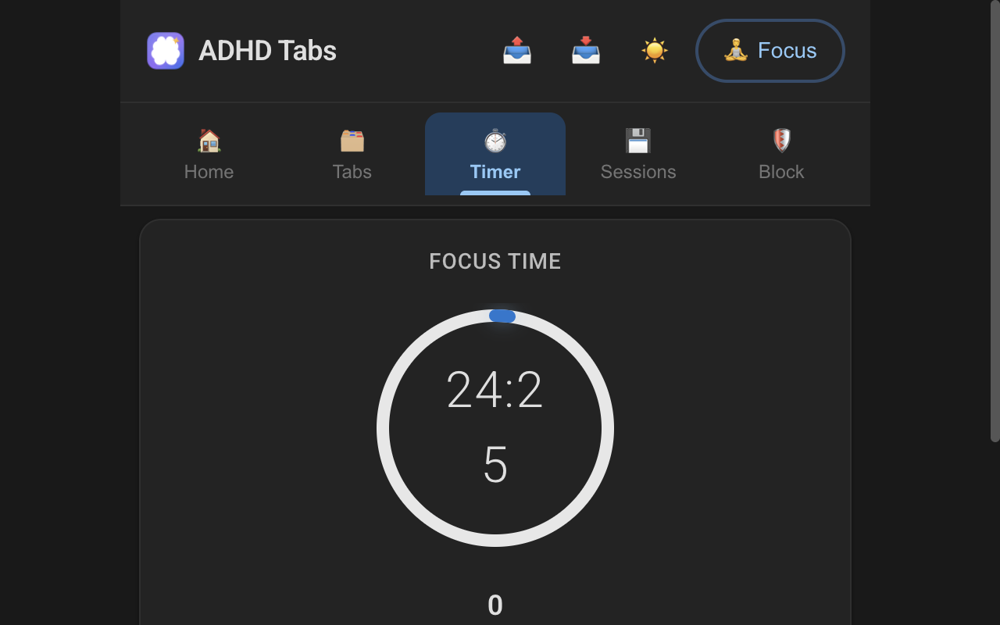
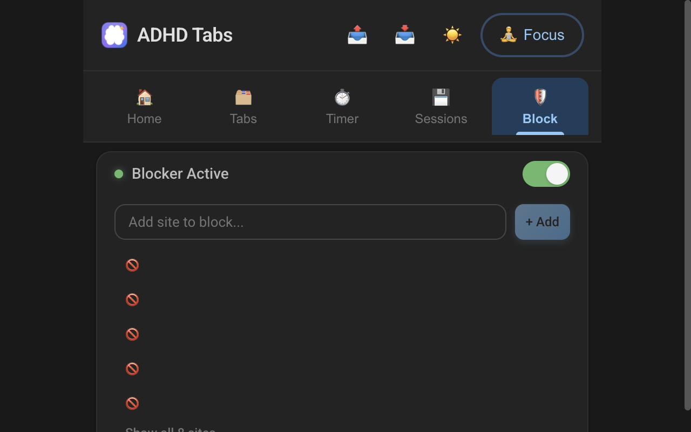

# 🧠 ADHD Tab Manager

[](https://github.com/ranka23/adhd_tab_manager/actions/workflows/ci.yml)
[](https://github.com/ranka23/adhd_tab_manager/actions/workflows/release.yml)
[](LICENSE)

> A browser extension designed specifically for ADHD brains — minimal clutter,
> one action at a time, dopamine-friendly tab management. Free, open source,
> and donation-supported. 💜

**ADHD Tab Manager** helps you regain focus when your browser is a battlefield:
one click hides every tab behind a calm focus screen, a Pomodoro timer keeps
you on a rhythm, distracting sites get quietly blocked, and your tab sessions
are always one click away from being saved and restored — even across multiple
windows.

Available for **Chrome**, **Edge**, **Firefox** and **Safari**. The side panel
is the default surface on Chrome/Edge/Firefox (a persistent, resizable panel —
no floating popup); Safari uses the classic toolbar popup.

---

## ✨ Features

### 🧘 Focus Mode
- One click to start focusing — every open tab is hidden behind a calm focus screen
- Distracting sites are blocked with a gentle interstitial instead of a harsh block page
- Distractions-avoided counter for dopamine hits
- A "distractions avoided" stat and an end-of-focus summary

### 🍅 Pomodoro Timer
- Beautiful circular SVG timer with start / pause / resume / reset / skip
- Customizable work / short-break / long-break durations (with validation)
- A **streak counter** that tracks real consecutive days
- Gentle audio chime + system notification when a phase completes — **even with
  the popup/panel closed** (the service worker owns the countdown)
- 4 pomodoros → long break, automatically

### 💾 Session Saver
- Save your open tabs as a named session (with icon + smart suggestions)
- **Multi-window aware**: with several windows open, the save dialog asks
  *which* window(s) to snapshot — "Window 1 only", "Window 2 + 3", etc. It
  never silently merges every window into one session
- Restore a session (pinned tabs restore pinned, order preserved) with one click
- Undo-close history (max 20) restores accidentally closed tabs — **into their
  original window and index**
- Auto-saves every 5 minutes as a safety net

### 🛡️ Distraction Blocker
- Pre-loaded with common distracting sites (reddit, youtube, twitter, …)
- Add / remove sites; normalized input (`HTTPS://Twitter.Com ` → `twitter.com`)
- Duplicate and invalid input rejected inline
- Works in the background — a blocked site redirects to the interstitial even
  when the extension UI is closed
- Toggle the whole blocker on/off with one switch

### 🪟 Multi-Window & Live Data
- **Live data everywhere**: every surface (side panel, popup) updates itself
  the instant tabs or windows change — close a tab, open a window, or change
  state in the other surface and the UI is instantly current. No refresh,
  no reopen
- **Tabs are grouped by window** in the Tabs view ("Window 1 / Window 2", the
  focused window marked) — tabs belong to their window
- **Close Window** closes a single window's non-pinned tabs (with a per-window
  picker when several windows are open); **Close All** is window-aware with a
  per-window breakdown in the confirm dialog
- Undo-close restores tabs into their original window

### 📌 Side Panel (default surface — Chrome / Edge / Firefox)
- **The toolbar button opens the side panel directly** — no floating popup
  (`sidePanel` + `setPanelBehavior({ openPanelOnActionClick: true })` on
  Chromium, `sidebar_action` on Firefox)
- Same features as the popup in a persistent, resizable surface; theme and
  state stay in sync across surfaces
- The open-tabs list fills the panel height and scrolls internally (no page
  scroll, no horizontal overflow)
- **Safari** (no side panel API) keeps the classic toolbar popup —
  `pnpm build:safari` → `dist-safari/`

### 🏠 Home Tab
- Rotating **Tao Te Ching quotes** — each one cites its chapter and verse
  (e.g. *"— Tao Te Ching, Ch. 8, v. 1"*)
- Daily progress stats: focus minutes, sessions saved, distractions blocked
- Quick Actions: close-all (with undo), close window, undo-close
- **Request a Feature or Report a Bug** card → GitHub Issues
- **Donate** card (last section) → crypto donation modal

### 💜 Donations & Open Source
- Free and open source (MIT) — no data collection, ever
- **Donate with crypto**: the donation modal shows the **Ethereum** and
  **Solana** wallet addresses with their QR codes and one-tap copy buttons
  (USDC/USDT go to the Ethereum address). The QR images are the actual wallet
  QR codes from the [SideRouter](https://github.com/ranka23/side-router) project
- The modal footer links to this repository — open source, forever

---

## 📦 Browser Support

| Browser | Artifact | Notes |
|---|---|---|
| **Chrome** | `dist/` | Manifest V3, service worker, side panel default surface |
| **Edge** | `dist/` | Same Chromium build as Chrome |
| **Firefox** | `dist-firefox/` | Manifest V3 event-page background, `sidebar_action` (open on install) |
| **Safari** | `dist-safari/` | Classic popup surface (Safari has no side panel API); packaged with `safari-web-extension-packager` |

---

## 📸 Screenshots

The side panel — the default surface on Chrome, Edge and Firefox:



Home tab with live tabs grouped by window and the daily Tao Te Ching quote:




Tabs grouped by window · Saved sessions · Pomodoro timer · Distraction blocker:






---

## 🚀 Installation (from the stores — coming soon)

The extension is being submitted to the Chrome Web Store, Edge Add-ons,
Firefox AMO and the App Store. Until then, load it as an unpacked extension:

### Chrome / Edge
1. Run `pnpm build` (or `pnpm build:all`)
2. Open `chrome://extensions/` (or `edge://extensions/`)
3. Enable **Developer mode**
4. Click **Load unpacked** → select the `dist/` directory
5. Click the toolbar icon → the **side panel opens** (the default surface)

> 💡 **Toolbar click not opening the side panel?** If you loaded the extension
> *before* the side-panel change, Chrome caches the old action config —
> **Remove the extension and click "Load unpacked" again** (or use a fresh
> profile). The current build opens the panel natively via
> `chrome.sidePanel.setPanelBehavior({ openPanelOnActionClick: true })`.

### Firefox
1. Run `pnpm build:firefox`
2. Open `about:debugging#/runtime/this-firefox`
3. Click **Load Temporary Add-on** → select `dist-firefox/manifest.json`
4. The **sidebar opens automatically** on install; the toolbar button toggles it

### Safari
1. Run `pnpm build:safari`
2. Wrap `dist-safari/` with `safari-web-extension-packager` (Xcode)

---

## 🛠️ Development

### Prerequisites
- Node.js 18+
- pnpm

### Setup

```bash
pnpm install

# Build all targets: dist/ (Chrome/Edge) + dist-firefox/ (+ dist-safari/ with the Safari target)
pnpm build:all
pnpm build:safari   # adds dist-safari/ (popup surface, no side panel)

# Unit + integration tests (280)
pnpm test

# Lint (ESLint + TypeScript strict)
pnpm lint

# Firefox add-on lint (web-ext)
pnpm lint:firefox

# Format (Prettier)
pnpm format
```

### Real-browser verification (Chrome for Testing)

```bash
# Automated Chrome e2e (50 checks, headless, temp profile)
node scripts/e2e/chrome-e2e.mjs

# Full manual-test matrix (78 checks — real clicks/tabs/windows/storage/SW)
node scripts/e2e/manual-test.mjs

# + the ~60s service-worker tick test (timer completes with popup closed)
MANUAL_TEST_SLOW=1 node scripts/e2e/manual-test.mjs

# Side-panel (15) + multi-window (9) smoke suites
node scripts/e2e/sidepanel-smoke.mjs
node scripts/e2e/multiwindow-smoke.mjs

# Home donation + feedback sections (15 checks — real browser)
node scripts/e2e/donate-smoke.mjs

# Interactive environment for MCP-driven / human testing (Chrome for Testing :9222)
node scripts/e2e/start-test-env.mjs
```

Results & plans: `docs/manual-test-results.md`, `docs/manual-test-plan.md`, `adhd-prod-todo.md`.

### Manual test plan

A full human-verifiable test plan (sections 1–16, ~90 checks) lives in
[`docs/manual-test-plan.md`](docs/manual-test-plan.md) — render, theme, focus
mode, blocker, sessions, undo-close, Pomodoro, quick actions, export/import,
responsive/mobile widths, Firefox parity, side panel and donations.

### Release & publishing (CI)

Pushing a `v*` tag triggers [GitHub Actions](.github/workflows/release.yml):
build all targets → create the 4 store zips → attach zips + screenshots to a
GitHub Release → publish to Chrome Web Store and Firefox AMO (when the
secrets are configured). See
[`docs/release-publishing.md`](docs/release-publishing.md) for the one-time
setup and what each store's API can automate.

---

## 🧱 Tech Stack

- **Language**: TypeScript (strictest config)
- **UI**: React 18
- **Build**: Vite + @crxjs/vite-plugin
- **Testing**: Vitest + @testing-library/react
- **Linting**: ESLint + Prettier
- **Storage**: `chrome.storage.local` (all state stays on-device)
- **Architecture**: Manifest V3

## 📁 Project Structure

```
src/
├── popup/            # React UI for the popup + side panel surfaces
│   ├── components/   # Reusable UI components (FocusMode, PomodoroTimer,
│   │                 #  SessionSaver, TabGroup, DonateCard, FeedbackCard, …)
│   ├── hooks/        # Custom React hooks (useTabs, useSessions, useTimer, …)
│   ├── services/     # Chrome API abstractions
│   ├── types/        # TypeScript type definitions
│   ├── utils/        # Helper functions
│   └── styles/       # CSS stylesheets (design system, components, animations)
├── sidepanel/        # Side panel entry — the DEFAULT surface on Chrome/Edge/Firefox
├── background/       # Service worker (focus blocker, timer, auto-save, alarms)
├── shared/           # Cross-surface constants, browser wrapper, storage keys
public/
├── icons/            # Extension icons (16/32/48/128) + the logo SVG
└── donate/           # Wallet QR-code images (ETH + SOL)
scripts/
└── e2e/              # Real-browser harnesses (start-test-env, chrome-e2e,
                      #  manual-test, sidepanel-smoke, multiwindow-smoke,
                      #  donate-smoke, generate-icons)
```

## 🧠 Design Principles

ADHD-specific design decisions:

- **Calm color palette** — soft blues, muted greens, warm neutrals
- **One primary action** per screen
- **Dopamine rewards** — celebrate small wins with gentle animations
- **Minimal text** — icons and short labels
- **Forgiving UX** — "Undo" everything; no destructive action without confirmation
- **Rounded, soft UI** — large border-radius, soft shadows, no sharp edges
- **Progress indicators** — progress bars, streaks, daily stats
- **Reduced motion respected** — `prefers-reduced-motion` tones down animations
- **Keyboard accessible** — visible focus rings, focus-trapped modals, Escape to close

## 🔒 Privacy

**ADHD Tab Manager collects no data.** Everything lives in your browser's
local extension storage (`chrome.storage.local`) — sessions, settings, stats.
Nothing is sent anywhere; the only network-bound action is when *you* click a
link (GitHub Issues, the open-source repo). The background service worker
redirects blocked sites to a local interstitial page — no remote calls.

## 🤝 Contributing

Found a bug or want a feature? Open an
[issue](https://github.com/ranka23/adhd_tab_manager/issues) — every report
helps make the extension better for everyone. PRs are welcome.

## 💜 Donate

ADHD Tab Manager is free and open source. If it helps you stay focused,
consider a small donation — **Ethereum (ETH/USDC/USDT)** and **Solana (SOL)**
are accepted via the **Donate** card on the Home tab (wallet QR codes + copy
buttons). Every bit helps pay the bills and keep the project alive.

**Ethereum (ETH/USDC/USDT):**
`0x907DB6Ad294bD6B9adAE4C2340d34883E32F121A`

**Solana (SOL):**
`H9kw2HG3eik5uKYoULHuzohoY7gCi1Jfqk38ppn1Szyo`

You can also send a donation directly to either wallet above — the same
addresses shown in the app's Donate card.

## 📄 License

MIT — free, open source, and donation-supported. 💜
